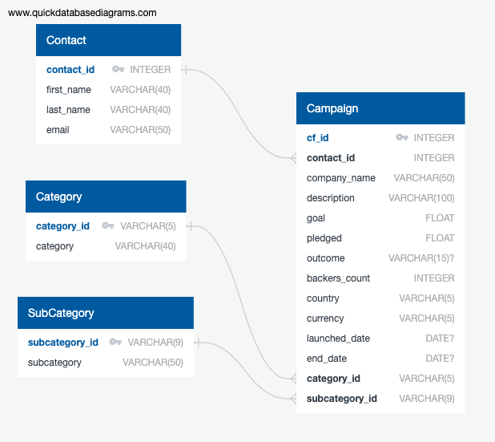

# Crowdfunding_ETL

This project takes the crowd funding data provided in excel files through **Extract Transform and Load (ETL)** process and makes it avaialble in a relational database for further usage. 

## Datasets

The input dataset is provided in 2 excel files - **[crowdfunding.xlsx](./Resources/crowdfunding.xlsx) & [contacts.xlsx](./Resources/contacts.xlsx).**

The Crowd Funding data contains information about various projects requesting funding. The data provided needs to be extracted, transformed and loaded into a relational database so that the crowd funding requests can be futher analyzed. 

## Extract

The data is extracted from excel file to a Pandas DataFrame.
The category and sub-category information from [crowdfunding.xlsx](./Resources/crowdfunding.xlsx) is extracted to **Category and Sub-category DataFrames** respectievely.
The rest of the data from [crowdfunding.xlsx](./Resources/crowdfunding.xlsx) is extracted to **Campaign DataFrame**.
The contact information from [contacts.xlsx](./Resources/contacts.xlsx) is extracted to **Contact DataFrame**. The contact information is provided as a JSON string in the excel file. The JSON string is converted to JSON object/Python Dictionary using json library.  

## Transform

**Category** - The unique values of category data loaded into the Category DataFrame is given a unique identifier for each value. The data is then saved to a csv file ([category.csv](./Resources/category.csv)). 

**Sub-Category** - The unique values of sub-category data loaded into the Sub-Category DataFrame is given a unique identifier for each value. This data is then saved to a csv file ([subcategory.csv](./Resources/subcategory.csv)).

**Campaign** - 
  * Column Rename: 'blurb', 'launched_at' and 'deadline' columnns of Campaign DataFrame are renamed to 'description', 'launched_date' and 'end_date' respectively.
  * Change Data Types:
    - 'goal' and 'pledged' columns are converted to 'float' data type using Pandas 'to_numeric' method.
    - 'launched_date' and 'end_date' columns are converted from time since epoch to datatime using Pandas to_datetime method and then converted to 'YYYY-MM-DD' format using datetime strftime() method
  * Merge DataFrames - 'Campaign' DataFrame is merged with 'Category' and 'SubCategory' DataFrame on 'category' and 'subcategory' columns respectievely to add 'category_id' and 'subcategory-id' to the 'Campaign' DataFrame
  * Drop unwanted columns from the DataFrame
  * The data is saved to a csv file ([campaign.csv](./Resources/campaign.csv))

**Contact** - 'name' column is split to 'first_name' and 'last_name' columns. 'name' column is dropped from the DataFrame. The columns are rearranged and saved to a csv file ([contacts.csv](./Resources/contacts.csv)).  
  
## Load
  * ER Diagram - [QuickDBD](https://www.quickdatabasediagrams.com/) is used to create Entity Relationship diagram and generate SQLs to create the database tables.
  * Create Database - The Postgres database **crowdfunding_db** is created using PGAdmin tool.
  * Create Tables - The SQLs generated [crowdfunding_db_schema.sql]( ./database/crowdfunding_db_schema.sql) were executed using PGAdmin Query tool to create the tables.
  * Load Data - The CSV files were imported into the tables created.
  * Analyze Data - The data loaded into the tables were analyzed by running select * queries on all the tables.

## Files

* Input Data -
   - ./Resources/crowdfunding.xlsx
   - ./Resources/contacts.xlsx

* Transformed Files
  - ./Resources/category.csv
  - ./Resources/subcategory.csv
  - ./Resources/campaign.csv
  - ./Resources/contacts.csv

* Source
  - ETL_Mini_Project_RJothis_REsser.ipynb 

* ERD - ./database/ERDiagram-CrowdFundingDB.png

* Database Documentation - ./database/Documentation-CrowdFundingDB.pdf

* DDL script - ./database/crowdfunding_db_schema.sql

* Analysis script - ./database/crowdfunding_db_analysis.sql
 

## Run Insturctions

* Open [**ETL_Mini_Project_RJothis_REsser.ipynb**](./ETL_Mini_Project_RJothis_REsser.ipynb) file using Jupyter Notebook
  - Click on 'Cell > Run All' to run
  - This will create transformed csv files under 'Resources' folder

* Use PostgreSQL database or any other relational database of your choice to create 'crowdfunding_db' database

* Open a Query Tool for crowdfunding_db database

* Run [crowdfunding_db_schema.sql](database/crowdfunding_db_schema.sql) to create the tables

* Import data into each table from csv files under Resources directory in the following order
  1. ./Resources/category.csv
  2. ./Resources/subcategory.csv
  3. ./Resources/contacts.csv
  4. ./Resources/campaign.csv

* Open [crowdfunding_db_analysis.sql](./database/crowdfunding_db_analysis.sql) using Query Tool and run the SQL queries to analyze the data
    
# Disclaimer
This repo was published for educational purpose only. Copyright 2024 edX Boot Camps LLC. All rights reserved.

